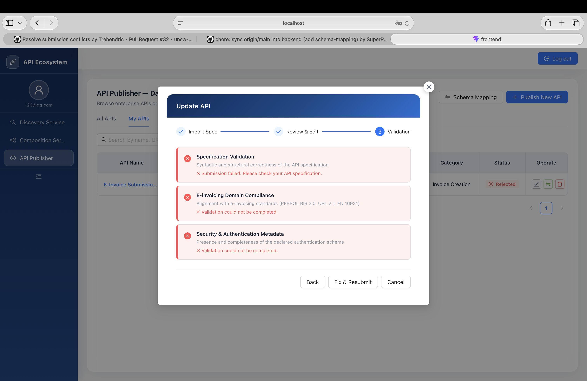

# Bug Test Report

> 测试过程中发现的问题统一记录在此文档中，后续可继续追加复现步骤、截图、处理状态和备注。

## Bug 001 - 已发布 API 修改时报错

- **发现日期**：2026-07-22
- **模块**：API Publisher
- **相关页面**：My APIs / Update API
- **优先级**：待评估
- **状态**：待修复

### 问题描述

已发布的 API 如果尝试进行更改，例如修改 API 名称，会提示只有 draft 状态可以修改，并导致提交失败。修改失败后，原本的 `Published` 状态会被直接改成 `Rejected`，并且编辑后无法再次发布，除非重新上传 API 文件。

### 复现步骤

1. 进入 `API Publisher` 页面。
2. 切换到 `My APIs`。
3. 选择一个已经发布或非 draft 状态的 API。
4. 点击编辑按钮并尝试修改 API 信息，例如 API 名称。
5. 提交更新。
6. 返回 API 列表，查看该 API 的状态。
7. 尝试再次发布该 API。

### 实际结果

系统进入 `Update API` 的校验步骤后提交失败，并显示校验错误。错误信息包括：

- `Submission failed. Please check your API specification.`
- `Validation could not be completed.`

用户反馈该场景下会提示只有 `draft` 能修改，并报错。

补充现象：

- 原本状态为 `Published` 的 API，在修改失败后会变成 `Rejected`。
- 进入 `Rejected` 状态后，继续编辑也无法成功发布。
- 当前只能通过重新上传 API 文件来恢复发布流程。

### 期望结果

系统应明确限制已发布 API 的可编辑行为，并给出清晰提示。例如：

- 如果业务规则不允许修改已发布 API，应在进入编辑流程前禁用编辑入口或提示原因。
- 如果允许修改部分字段，应只开放可修改字段，并避免触发与实际操作无关的 API specification 校验失败。
- 修改失败不应改变原 API 的发布状态，尤其不应把已有 `Published` API 回退为 `Rejected`。
- 对已发布 API 的编辑应有明确的版本管理或草稿机制，失败时保留线上已发布版本不受影响。

### 截图

### 备注

- 截图中 API 状态显示为 `Rejected`，用户已补充该状态是由原本 `Published` API 修改失败后变更而来。
- 需要进一步确认该问题是否只发生在已发布 API，还是所有非 `draft` 状态 API 均会触发。
- 建议后续确认后端返回的具体错误码和前端展示逻辑是否一致。
- 建议重点检查更新接口是否在校验失败时错误地覆盖了 API 状态字段。

## Bug 002 - 无法删除 Rejected 状态的 API

- **发现日期**：2026-07-22
- **模块**：API Publisher
- **相关页面**：My APIs
- **优先级**：待评估
- **状态**：待修复

### 问题描述

处于 `Rejected` 状态的 API 无法被删除。

### 复现步骤

1. 进入 `API Publisher` 页面。
2. 切换到 `My APIs`。
3. 找到一个状态为 `Rejected` 的 API。
4. 点击删除按钮。
5. 确认删除操作。

### 实际结果

删除失败，`Rejected` 状态的 API 仍然保留在列表中。

### 期望结果

系统应允许用户删除不再需要的 `Rejected` API，或在业务规则不允许删除时提供清晰原因和可执行的后续操作。

### 截图

待补充。

### 备注

- 该问题可能与 Bug 001 关联：已发布 API 修改失败后会进入 `Rejected` 状态，而进入该状态后又无法删除，导致用户无法清理异常 API。
- 建议检查删除接口是否限制了可删除状态，或前端是否对 `Rejected` 状态调用了错误的删除逻辑。
